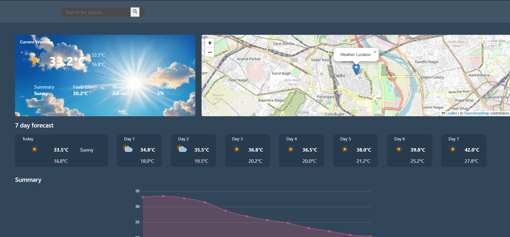

# Weather Project

## Overview
This project provides weather updates for various locations, giving users current weather conditions and forecasts.

## Screenshots

### Weather Details


## Features
- Real-time weather updates.
- 7-day weather forecast.
- Displays temperature, humidity, wind speed, and other relevant data.

## How to Run
Follow the instructions below to set up and run the project.

### Prerequisites
Ensure you have the following installed:
- Python 3.10.0 or higher
- Pip for Python package installation

### Installation
1. Clone the repository:

   ```bash
   git clone https://github.com/yourusername/weather-project.git


    ```
    ```bash
    cd weather
    ```

2. Install the required packages:
   ```bash
   pip install -r requirements.txt
   ```

3. Set up your environment variables. Create a `.env` file in the root directory and add your API key:
   ```bash
   API_KEY=your_api_key_here
   ```

### Running the Project
1. Start the application:
   ```bash
   python app.py
   ```
2. Open your web browser and navigate to `http://localhost:5000`.
3. Enter a location in the search bar to get the weather updates.
4. Click on the "Search" button to fetch the weather data.
5. The weather details will be displayed on the page.